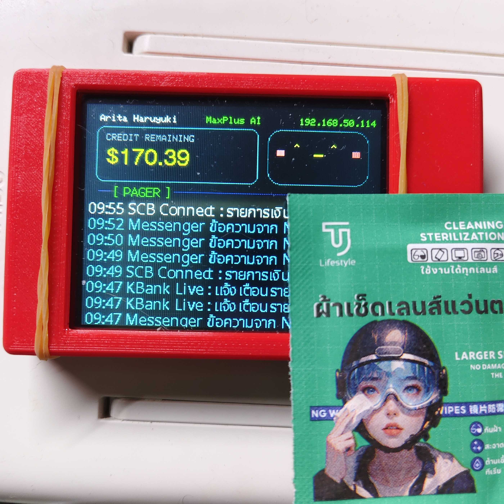

# CYD MaxPlus AI Monitor

โปรเจคนี้เป็นเฟิร์มแวร์สำหรับบอร์ด **ESP32-2432S028R / CYD (Cheap Yellow Display)** ใช้เป็นหน้าจอมอนิเตอร์เครดิตของ MaxPlus AI และรับข้อความแจ้งเตือนผ่าน MQTT เพื่อแสดงบนจอ TFT ขนาด 320x240 พิกเซล



## ความสามารถหลัก

- เชื่อมต่อ WiFi และแสดงสถานะ IP / NO WIFI บนหน้าจอ
- เรียก API ของ MaxPlus AI เพื่อตรวจสอบเครดิตคงเหลือ
- แสดงชื่อผู้ใช้และเครดิตแบบ dashboard บนจอ CYD
- รับข้อความ pager ผ่าน MQTT แล้วแสดงเป็น feed ล่าสุดบนหน้าจอ
- รองรับข้อความภาษาไทยด้วยฟอนต์ Noto Sans Thai ที่แปลงเป็น header สำหรับฝังใน firmware
- แสดง icon อัตโนมัติจาก keyword ในข้อความ เช่น สถานะ online/down, warning และ heart
- reconnect WiFi และ MQTT อัตโนมัติเมื่อการเชื่อมต่อหลุด
- ใช้ RGB LED ด้านหลังบอร์ดบอกสถานะพื้นฐาน

## Hardware

- Board: ESP32-2432S028R / CYD / HW-458
- Display: ILI9341 TFT 320x240
- Rotation: landscape
- RGB LED pins:
  - RED: GPIO 4
  - GREEN: GPIO 16
  - BLUE: GPIO 17

## Software Stack

- PlatformIO
- Arduino framework
- TFT_eSPI
- ArduinoJson v7
- PubSubClient
- tcUnicodeHelper
- Python script สำหรับสร้างฟอนต์ไทย

## หน้าจอหลัก

หน้าจอแบ่งเป็น 4 ส่วนหลัก:

1. แถบบนสุดแสดงชื่อผู้ใช้, ชื่อระบบ และสถานะ WiFi/IP
2. กล่องซ้ายแสดงเครดิตคงเหลือ
3. กล่องขวาแสดงหน้า mascot / สถานะ
4. ส่วน pager feed สำหรับข้อความจาก MQTT

## MQTT Pager

อุปกรณ์ subscribe topic ที่กำหนดใน `src/CYD_Config.h`

ค่าเริ่มต้น:

```text
MQTT_TOPIC = cyd/pager
```

keyword ที่ใช้สร้าง icon บน feed:

| Keyword | การแสดงผล |
| --- | --- |
| `[UP]`, `[Up]`, `[ONLINE]` | วงกลมสีเขียว |
| `[DOWN]`, `[Down]` | วงกลมสีแดง |
| `[WARN]` | สามเหลี่ยมเตือนสีแดง |
| `[LOVE]`, `<3` | รูปหัวใจสีแดง |

มีไฟล์ `main.py` สำหรับส่งข้อความทดสอบเข้า pager endpoint ได้ เช่น:

```bash
python main.py --url http://localhost:3883/pager --text "Hello [ONLINE]"
python main.py --url http://localhost:3883/pager --list
```

ถ้า endpoint ต้องใช้ secret ให้ส่งผ่าน environment variable หรือ argument:

```bash
PAGER_URL=http://localhost:3883/pager PAGER_SECRET=your-secret python main.py --text "Hello [ONLINE]"
python main.py --url http://localhost:3883/pager --secret your-secret --text "Hello [ONLINE]"
```

## API Credit Monitor

เฟิร์มแวร์เรียก API ที่กำหนดไว้ใน `src/CYD_Config.h`

```text
API_URL = https://api.maxplus-ai.cc/v1/me
```

ระบบจะอ่านค่าเครดิตจาก field ที่รองรับ เช่น:

- `credit_usd`
- `user.credit_usd`
- `balance`
- `balance_usd`

ค่า refresh เริ่มต้นคือ 60 วินาที:

```text
REFRESH_INTERVAL_MS = 60000
```

## ฟอนต์ภาษาไทย

โปรเจคใช้ `NotoSansThai.ttf` เป็นฟอนต์ต้นทาง และแปลงเป็นไฟล์ header เพื่อฝังเข้า firmware:

```text
src/NotoSansThai16_tc.h
src/NotoSansThai24_tc.h
```

สร้างฟอนต์ใหม่ได้ด้วย:

```bash
python make_tcfont.py
```

ไฟล์ `make_vlw.py` เป็นสคริปต์สำหรับสร้างฟอนต์ `.vlw` ในโฟลเดอร์ `data/` เผื่อใช้งานกับ TFT_eSPI Smooth Font / SPIFFS

## โครงสร้างไฟล์

```text
.
├── src/
│   ├── main.cpp              # firmware หลัก
│   ├── CYD_Config.example.h  # template สำหรับ WiFi, API, MQTT, pin และสีของ UI
│   ├── CYD_Config.h          # config จริงในเครื่อง local ไม่ควร commit
│   ├── NotoSansThai16_tc.h   # ฟอนต์ไทยสำหรับ tcUnicodeHelper
│   └── NotoSansThai24_tc.h   # ฟอนต์ไทยขนาด 24px
├── data/
│   ├── NotoSansThai18.vlw    # ฟอนต์ VLW
│   └── NotoSansThai24.vlw    # ฟอนต์ VLW
├── main.py                   # script ส่งข้อความทดสอบ pager
├── make_tcfont.py            # script สร้างฟอนต์ header
├── make_vlw.py               # script สร้างฟอนต์ VLW
├── NotoSansThai.ttf          # ฟอนต์ต้นทาง
├── platformio.ini            # config สำหรับ build/upload
└── PROJECT.md                # note รายละเอียดระหว่างพัฒนา
```

## การตั้งค่า

คัดลอกไฟล์ตัวอย่างเป็น config local:

```bash
cp src/CYD_Config.example.h src/CYD_Config.h
```

บน Windows PowerShell:

```powershell
Copy-Item src\CYD_Config.example.h src\CYD_Config.h
```

แล้วแก้ไขค่าหลักในไฟล์:

```text
src/CYD_Config.h
```

ค่าที่ควรตั้งก่อน build:

- `WIFI_SSID`
- `WIFI_PASSWORD`
- `API_URL`
- `API_KEY`
- `MQTT_HOST`
- `MQTT_PORT`
- `MQTT_USER`
- `MQTT_PASS`
- `MQTT_TOPIC`

> `src/CYD_Config.h` ถูก ignore โดย git เพราะอาจมี WiFi password, API key และ MQTT password ส่วนไฟล์ที่ควร commit คือ `src/CYD_Config.example.h`

## Build และ Upload ลง ESP32-CYD

โปรเจคนี้ใช้ PlatformIO และกำหนด environment เริ่มต้นไว้เป็น `esp32-2432S028R` ใน `platformio.ini`

### 1. เตรียมเครื่อง

ติดตั้งเครื่องมืออย่างใดอย่างหนึ่ง:

- Visual Studio Code + PlatformIO IDE extension
- หรือ PlatformIO Core ผ่าน Python:

```bash
pip install platformio
```

ตรวจสอบว่าเรียกคำสั่ง `pio` ได้:

```bash
pio --version
```

ถ้า Windows มองไม่เห็นบอร์ดเมื่อต่อ USB ให้ติดตั้ง driver USB-Serial ของบอร์ดที่ใช้ เช่น CH340 หรือ CP210x

### 2. ตั้งค่าก่อน build

ถ้ายังไม่มีไฟล์ config local ให้สร้างจาก template ก่อน:

```bash
cp src/CYD_Config.example.h src/CYD_Config.h
```

บน Windows PowerShell:

```powershell
Copy-Item src\CYD_Config.example.h src\CYD_Config.h
```

จากนั้นแก้ค่าในไฟล์:

```text
src/CYD_Config.h
```

อย่างน้อยควรตั้งค่าเหล่านี้ให้ถูกต้องก่อนอัปโหลด:

```text
WIFI_SSID
WIFI_PASSWORD
API_URL
API_KEY
MQTT_HOST
MQTT_PORT
MQTT_USER
MQTT_PASS
MQTT_TOPIC
```

### 3. ต่อบอร์ดและหา port

เสียบ ESP32-CYD ด้วยสาย USB ที่รองรับ data แล้วดู port:

```bash
pio device list
```

บน Windows มักเป็น `COM3`, `COM4` หรือหมายเลขใกล้เคียง ส่วน macOS/Linux มักเป็น `/dev/ttyUSB0` หรือ `/dev/tty.SLAB_USBtoUART`

### 4. Build firmware

รันคำสั่งจากโฟลเดอร์โปรเจค `ESP32-CYD-MaxPlus-AI-Monitor`:

```bash
pio run -e esp32-2432S028R
```

ถ้า build สำเร็จ firmware จะถูกสร้างไว้ใน `.pio/build/esp32-2432S028R/`

### 5. Upload firmware ลงบอร์ด

ถ้า PlatformIO เลือก port ได้เอง:

```bash
pio run -e esp32-2432S028R --target upload
```

ถ้าต้องระบุ port เอง ให้แทน `COMx` ด้วย port ที่เจอจาก `pio device list`:

```bash
pio run -e esp32-2432S028R --target upload --upload-port COMx
```

ตัวอย่างบน Windows:

```bash
pio run -e esp32-2432S028R --target upload --upload-port COM4
```

หลัง upload เสร็จ บอร์ดจะรีสตาร์ทและเริ่มแสดง dashboard บนหน้าจอ CYD

### 6. เปิด Serial Monitor

ใช้สำหรับดู log, IP address, สถานะ WiFi, MQTT และ error จาก API:

```bash
pio device monitor -b 115200
```

ถ้าต้องระบุ port:

```bash
pio device monitor -b 115200 --port COMx
```

กด `Ctrl+C` เพื่อออกจาก monitor

### 7. ปัญหาที่พบบ่อยตอน upload

- ถ้าเจอ `Failed to connect to ESP32` ให้กดปุ่ม `BOOT` ค้างไว้ตอนเริ่ม upload แล้วปล่อยเมื่อเริ่มเขียน firmware
- ถ้า port ไม่ขึ้น ให้เปลี่ยนสาย USB, ลองช่อง USB อื่น หรือติดตั้ง driver USB-Serial
- ถ้า upload ช้ามากหรือหลุดบ่อย ให้ลด `upload_speed` ใน `platformio.ini` จาก `921600` เป็น `460800` หรือ `115200`
- ถ้าเปิด serial monitor ไม่ได้ ให้ปิดโปรแกรมอื่นที่อาจใช้งาน port เดียวกัน เช่น Arduino IDE, PuTTY หรือ monitor หน้าต่างอื่น
- ถ้า build error เรื่อง library ให้รัน `pio pkg install` หรือ build ใหม่ด้วย `pio run`; PlatformIO จะติดตั้ง dependency จาก `lib_deps` ใน `platformio.ini`

## หมายเหตุสำหรับ GitHub

ไม่ควรอัปโหลดไฟล์ cache หรือ build output เช่น:

```text
.pio/
__pycache__/
*.pyc
```

โปรเจคนี้ควรเก็บเฉพาะ source code, config ที่ปลอดภัย, font source/generated ที่จำเป็น และเอกสารประกอบเท่านั้น
